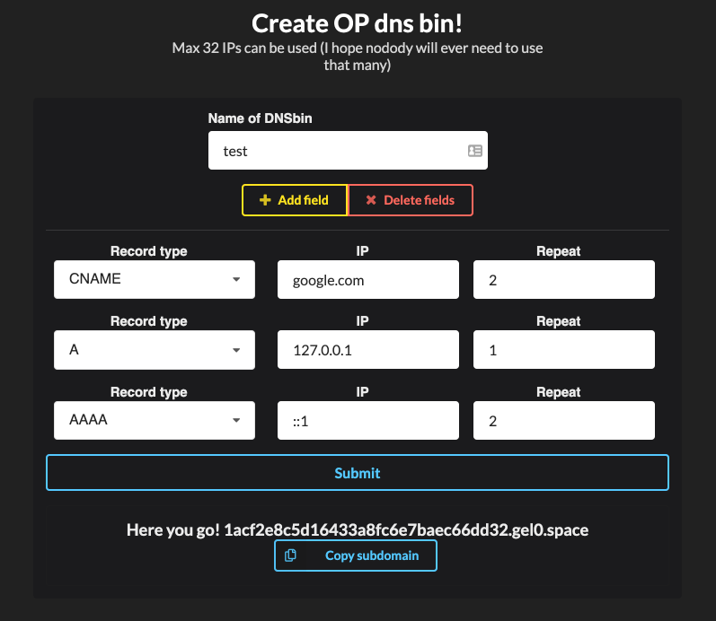
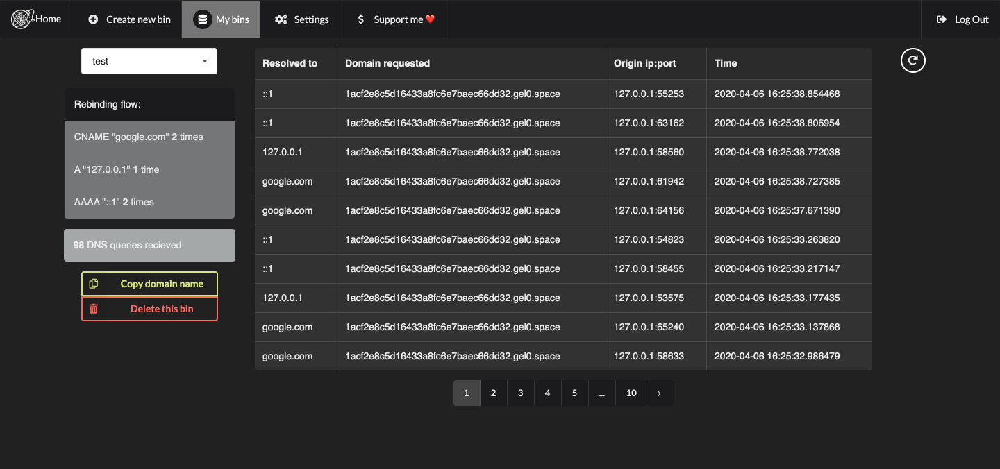

# DnsFookup v 1.0
[DNS Rebinding](https://en.wikipedia.org/wiki/DNS_rebinding) freamwork containing:
 - a dns server obviously
 - web api to create new subdomains and control the dns server, view logs, stuff like that
 - shitty react app to make it even more comfy


## What does it do?
It lets you create dns bins like a burp collaborator
but it adds a bit more features... (at least it tries to)


You can specify what ips should it resolve to and how many times, for now it *only supports A records* :(

Then you can see where it was requested from, what did it resolve to,... in logs



## How to run it

First of all, check the configuration in .py files, it's usually marked by

```
"""
*** CONFIG ***
"""
```

You also should not forget to change docker and redis passwords in
 - docker-compose.yml
 - app.py
 - dns_resources

```
#Set up postgres and redis
sudo docker-compose up

#in ./BE
pip3 install -r requirements.txt

python3 dns.py # to start the dns server

# for testing purposes development server is enough I think
FLASK_APP=app.py
FLASK_ENV=development
flask run

# then in ./FE
npm install
npm start
```

# Api documentation

For api to work you will need to be signed in - API is using bearer tokens for authentication and `Content-Type` has to be set to `application/json`

## Registration `/auth/signup`

`POST /auth/signup`
 *JSON body:*
```
{
    "username": "marek",
    "password": "ffffffff"
}
```
 *Response:*
```
{
    "name": "marek",
    "access_token": "eyJuYW1lIjoiMTMzMzMzMzMzMzMzMzMzMzMzMzMzMzMzMzMzMzMzMzMzMzMzMzMzMzMzMzMzMzMzMzMzMzMzMzMzMzMzMzMzMzMzMzMzMzMzMzMzMzMzMzMzMzMzMzMzNyBTZUtyM1QgVDBLM24ifQo="
}
```

## Login `/auth/login` (it's the same as signup)

`POST /auth/login`
 *JSON body:*
```
{
    "username": "marek",
    "password": "ffffffff"
}
```
 *Response:*
```
{
    "name": "marek",
    "access_token": "eyJuYW1lIjoiMTMzMzMzMzMzMzMzMzMzMzMzMzMzMzMzMzMzMzMzMzMzMzMzMzMzMzMzMzMzMzMzMzMzMzMzMzMzMzMzMzMzMzMzMzMzMzMzMzMzMzMzMzMzMzMzMzMzNyBTZUtyM1QgVDBLM24ifQo="
}
```

## Logout `/auth/logout`

`POST /auth/logout`

Json body can be left blank

 *Response:*
```
{
    "message": "Access token has been revoked"
}
```

## Get username

`GET /api/user`

 *Response:*
```
{
    "name": "marek"
}
```

## Create new token `/api/fookup/new`

`POST /api/fookup/new`
 *JSON body:*
```
{
	"name":"dsads",
	"ip_props":
	{
		"1":{
			"ip":"123.0.0.1"
			,"repeat":13

		},
		"2":{
			"ip":"3.2.1.1",
			"repeat": "4ever"
		}
	}
}
```

To get this straight
 - `"name"` is the name if the dns bin - it comes handy in frontend app
 - `"ip_props"` is where the magic happens
    * `"somenumber"` - these numbers have to be in order from 1 to how much you want (max 32), so no random numbers... the dns server will go from "1" and repeat the ip one after another as supplied, when it comes to the last ip, it will reset the counter and go from "1" again, if ``"4ever"`` is supplied in `repeat` field this loop will not continue and domain remains stuck on the 4ever IP
      - `"ip"` - this is the ip to resolve
      - `"repeat"` - how many times this ip should be resolved - this can be set to any positive integer or "4ever" to never stop resolving this ip after program gets to it

 *Response:*
```
{
    "subdomain": "0dd4d9083d7647e1a5fd5f1444e655ce.gel0.space"
}
```
this is the domain that will do the magic

### Example
let's say we supplied this
```
{
	"name":"dsads",
	"ip_props":
	{
		"1":{
			"ip":"1.1.1.1"
			,"repeat":2

		},
		"2":{
			"ip":"2.2.2.2",
			"repeat": 1
		}
	}
}
```
and we are running `host` command against this domain
```
$host {domain}
{domain} has address 1.1.1.1

$host {domain}
{domain} has address 1.1.1.1

$host {domain}
{domain} has address 2.2.2.2

$host {domain}
{domain} has address 1.1.1.1

$host {domain}
{domain} has address 1.1.1.1

$host {domain}
{domain} has address 2.2.2.2
... And this will go on and on
```

### EXAMPLE 2 with "4ever"

```
{
	"name":"dsads",
	"ip_props":
	{
		"1":{
			"ip":"1.1.1.1"
			,"repeat":2

		},
		"2":{
			"ip":"2.2.2.2",
			"repeat": "4ever"
		}
	}
}
```

Output of `host`
```
$host {domain}
{domain} has address 1.1.1.1

$host {domain}
{domain} has address 1.1.1.1

$host {domain}
{domain} has address 2.2.2.2

$host {domain}
{domain} has address 2.2.2.2

$host {domain}
{domain} has address 2.2.2.2

$host {domain}
{domain} has address 2.2.2.2

$host {domain}
{domain} has address 2.2.2.2

It will never resolve to 1.1.1.1 ...Almost
```

But there is one exception to this 4ever loop
info about what was resolved and what should be resolved next is stored in redis with expiration set to 1 hour, so the domain will resolve to 1.1.1.1 again in 1 hour after creating it. You can change this setting in REDIS_EXP variable in `dns.py` and `dns_resources.py`

## Delete token

`POST /api/fookup/delete`

*JSON body:*
```
{
 "uuid": "0dd4d9083d7647e1a5fd5f1444e655ce"
}
```

*Response:*
 ```
{
    "success": true
}
```


## List all bins `/api/fookup/listAll`

`GET /api/fookup/listAll`

 *Response:*
  ```
  [
      {
          "uuid": "0dd4d9083d7647e1a5fd5f1444e655ce",
          "name": "dsads"
      },
      {
          "uuid": "ffffffffffffffffffffffffffffffff",
          "name": "someothername"
      }
  ]
  ```

This will respond with uuids and names of all the bins you have ever created

## Get properties about specific bin `/api/fookup/props`

`POST /api/fookup/props`

 *JSON body:*


```
{
	"uuid":"0dd4d9083d7647e1a5fd5f1444e655ce"
}
```

 *Response:*

 ```
   {
      "ip_props": {
          "1": {
              "ip": "123.0.0.0",
              "repeat": 13
          },
          "2": {
              "ip": "0.0.1.77",
              "repeat": 3
          }
      },
      "ip_to_resolve": "1",
      "turn": 5,
      "name": "dsads"
  }
 ```
 This will return all info about the dnsbin, you already are familiar with the `ip_props` and `name` part so i will explain that other stuff
  - `"ip_to_resolve"`: number of ip the program should resolve to right now
  - `"turn"` - the number of times `"ip_to_resolve"` was already resolved so when turn == repeat, ip_to_resolve will become "2" and this will reset

## All logs `/api/fookup/logs/all`

This will return all logs from the all bins owned by user
This can be a bit slow if you requested the domains 12321312 times

`GET /api/fookup/logs/all`

*Response:*

```
[
   {
       "uuid": "0dd4d9083d7647e1a5fd5f1444e655ce",
       "resolved_to": "123.0.0.0",
       "domain": "0dd4d9083d7647e1a5fd5f1444e655ce.gel0.space",
       "origin_ip": "127.0.0.1",
       "port": "41095",
       "created_date": "2019-09-17 20:38:44.769560"
   },
...snip...
   {
       "uuid": "ffffffffffffffffffffffffffffffff",
       "resolved_to": "99.123.64.19",
       "domain": "0dd4d9083d7647e1a5fd5f1444e655ce.gel0.space",
       "origin_ip": "127.0.0.1",
       "port": "51515",
       "created_date": "2019-09-17 20:38:50.321975"
   }
]
```

## Logs for certain uuid /api/fookup/logs/uuid

`POST /api/fookup/logs/uuid`

*JSON body:*

```
{
 "uuid":"0dd4d9083d7647e1a5fd5f1444e655ce"
}
```


 *Response:*

```
[
    {
        "uuid": "0dd4d9083d7647e1a5fd5f1444e655ce",
        "resolved_to": "123.0.0.0",
        "domain": "0dd4d9083d7647e1a5fd5f1444e655ce.gel0.space",
        "origin_ip": "127.0.0.1",
        "port": "41095",
        "created_date": "2019-09-17 20:38:44.769560"
    },
...snip...
    {
        "uuid": "0dd4d9083d7647e1a5fd5f1444e655ce",
        "resolved_to": "0.0.1.77",
        "domain": "0dd4d9083d7647e1a5fd5f1444e655ce.gel0.space",
        "origin_ip": "127.0.0.1",
        "port": "51515",
        "created_date": "2019-09-17 20:38:50.321975"
    }
]
```

## Statistics `/api/statistics`

This just gets the statistics for the frontend app

`GET /api/statistics`

 *Response:*

 ```
 {
    "request_count": 420,
    "created_bins": 69
 }
 ```

# PLEASE

*If you have a bit of free time, please contribute, it means a lot to me :D*

## TODO

FE - in /mybins add a brief overview of selected bin

FE+BE - pagination on logs

FE+BE - delete bin

BE - CNAME!
